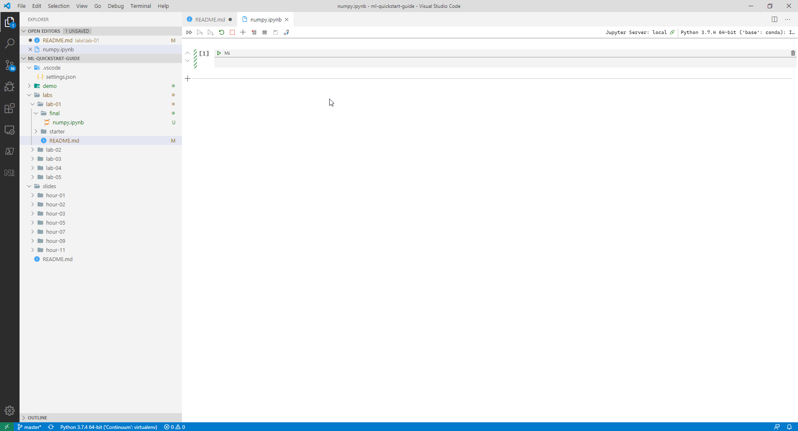

# LAB 1 - Exploring data with numpy

In this lab we'll start exploring data with numpy and pandas.
At the end of the lab you'll know

- How to load data as numpy arrays
- How to create new arrays
- How to perform arithmic operations on arrays
- How to combine arrays in numpy
- How to load data in pandas
- How to slice data frames in pandas
- How to combine data frames in pandas

This lab has two parts, first, we'll use numpy to process data.
Then, we'll take a look at pandas and how it improves upon numpy for
processing data.

## Part 1: Using numpy to work with data

In this first part, we'll perform some basic mathematical operations on data
using numpy. We'll look at:

- Loading arrays from disk
- Inspecting arrays
- Performing calculations with arrays
- Slicing and manipulating arrays

Let's start by loading data from disk.

### Step 1: Create a new notebook

Open the root folder of the course `ml-quickstart-guide` in VSCode.
Once you've opened the folder, expand the treeview until you see the folder
`labs/lab-01/starter`.

In the `starter` folder create a new file called `numpy.ipynb`. This is the file
we're going to use for exploring numpy.

You should get an editor window similar to this:



In this editor you can execute fragments of python interactively.
Notebooks are a useful tool when it comes to exploring data as they
allow you to execute code, visualize data, and document your work together in one place.

#### Quick tips

- You can add a new cell by clicking the plus button on the toolbar.
- Each cell is of a certain type. Select a cell, press <kbd>Esc</kbd> and
  then <kbd>M</kbd> to convert a cell to markdown or <kbd>Y</kbd> to convert it to python.
- You can reorder cells by dragging them around.
- You can execute a cell by pressing <kbd>Ctrl</kbd> + <kbd>Enter</kbd>

In the empty notebook, click on the first cell, and import the numpy package using the following code:

```python
import numpy as np
```

Use the function [numpy.load](https://numpy.org/doc/1.18/reference/generated/numpy.load.html?highlight=load#numpy.load) to load the file `../data/population.py` and store it in a variable `population`.

Now that we have the population data, we also need to load the
employment data from disk. This data is also stored as a numpy
array.

### Step 2: Load the employment data from disk

Using the same function as in the previous step, load the
file `../data/employment.npy` into a variable `employment_rate`.

Once we've loaded the second dataset, we can start to do some interesting things with the data.

### Step 3: Explore the loaded arrays

The arrays that we've loaded contain data about the population for a set of countries and employment figures for the same countries.

The employment data is stored as percentages while the population
is stored as absolute numbers.

Let's figure out if we can get from a percentage to an absolute number of people that are unemployed per country.

To do this, we first need to make sure that we have the right shape
for what we're trying to do.

Use the [shape](https://numpy.org/doc/1.18/reference/generated/numpy.ndarray.shape.html?highlight=shape#numpy.ndarray.shape) property on both arrays to figure out the dimensions
of the datasets. Make sure that the shapes are the same

Next, make sure that the data has the right type by checking the
[dtype](https://numpy.org/doc/1.18/reference/generated/numpy.ndarray.dtype.html?highlight=dtype#numpy.ndarray.dtype) property.

### Step 4: Calculate the absolute number of people that are unemployed

In the previous step we've made sure that we have the right type and shape of data. Now it's time to convert the percentage of unemployed people to an absolute number.

Print the first ten rows of the `employment_rate` array using
a combination of array slicing and the `print` function.

You'll notice that the employment rate is stored as a value
between 0 and 100. It's a percentage.

Use this knowledge to calculate the absolute number of
people employed using the `population` array and the `employment_rate` array.

Store the result of the calculation in the variable `absolute_employment`.

Now that you've done the maths, let's combine the results into
a single array.

### Step 5: Combine the array into a single array

To merge the separate arrays into a single array, we're going to use the [concatenate](https://numpy.org/doc/1.18/reference/generated/numpy.concatenate.html?highlight=concatenate#numpy.concatenate) function.
This function accepts a list of arrays and an axis to merge along.

Right now, our data is stored as 1-D arrays. But we need 2D-arrays if we want to concatenate along
the column axis rather than the row axis. To fix this, use the [reshape](https://numpy.org/doc/1.18/reference/generated/numpy.ndarray.reshape.html?highlight=reshape#numpy.ndarray.reshape) method to
reshape each of the arrays to have two dimensions.

Hint: use `-1` as the first argument for the target shape to let numpy determine the amount of rows to store!

Once you have the reshaped arrays, concate them using the [concatenate](https://numpy.org/doc/1.18/reference/generated/numpy.concatenate.html?highlight=concatenate#numpy.concatenate) function.

That's it, you now have created a dataset in numpy.

## Part 2: Processing data with pandas

In the previous steps we've only used numpy to process the data. There's a distinct
downside to working with numpy:

- You can't store numbers and strings in the same array
- You don't have any labels for columns

Panda's is a much better tool for what we just did. So let's use pandas instead
of numpy.

### Step 6: Upgrade your data wrangling to pandas

To work with pandas, we need to import the pandas package.
Create a new cell in your notebook and add the following code to import the
pandas package:

```python
import pandas as pd
```

Next, use the [pandas.load_csv](https://pandas.pydata.org/pandas-docs/stable/reference/api/pandas.read_csv.html) function to load
the file `../data/population.csv` and save it in the variable `df_population`.

To the same for the file `../data/employment_rate.csv` and store that in
the variable `df_employment`.

### Step 7: Inspect the data

Once you've load the pandas data frames, inspect them by calling the
[info](https://pandas.pydata.org/pandas-docs/stable/reference/api/pandas.DataFrame.info.html?highlight=info#pandas.DataFrame.info) method on each of the dataframes.

Check that the data is loaded and inspect the size of the data frame.

Note, what the index looks like. We want our data indexed by country, but currently
the data is indexed with numbers instead. We need to fix the code we used to load
the data for this.

Modify the code that invokes `read_csv` method to include the setting `index_col=0`
as an extra parameter. This will convert the first column in the CSV file to
the index of the dataset.

This index will come in handy when we want to merge the two datasets.

### Step 8: Merge the data frames

Let's merge the data frames into a single larger data frame.
When you use the [head]() method on the data frames you'll see
that they have multiple columns containing data per year.

We want the data for 2020 for employment and population in a single data
frame. It's impossible to do that for the current layout of the data frames.

So, before we merge, we need to select the right columns from both data frames.
First, filter the population data frame on the year 2020.

```python
df_population_2020 = df_population[['2020']]
```

Note, that we provide a list of columns to select. You'll get a series when you specify
a single column name. That will remove the index, that we'll need later to merge the data frames.

Now that you have the population for 2020, repeat the process for employment.
Store the results in the `df_employment_2020` variable.

```python
df_employment_2020 = df_employment[['2020']]
```

Note that both data frames will have a column `2020`. When we'll merge the data frames now, you will
get an error telling you the column names are not compatible. To prevent this from happening,
make sure to rename the columns in the data frames using the following piece of code:

```python
df_population_2020.columns = ['population']
df_employment_2020.columns = ['employment_rate']
```

After extracting the figures for 2020 from both datasets, we can merge the data frames
using the [concat](https://pandas.pydata.org/pandas-docs/stable/reference/api/pandas.concat.html?highlight=concat#pandas.concat) function.

Use both data frames as input, and make sure you specify `axis=1` to merge the columns rather than the rows.
Store the results in the variable `df_output`.

### Step 9: Inspect the results

Now that you've got the data merged, inspect the results by invoking the `head` method on `df_output`. This should show you ouput that looks like this:

```
            population	employment_rate	absolute_employment
-----------------------------------------------------------
Afghanistan	  38100000	           49.5	         18859500.0
Albania	       2940000	           47.2	          1387680.0
Algeria	      43300000	           37.1	         16064300.0
Andorra	         77200	            NaN	                NaN
Angola	      32800000	           70.3	         23058400.0
```

## Summary

In this lab you've explored data in numpy and pandas.
In part 1, you've learned how to load, inspect, and manipulate arrays.
Then in part 2, you've learned how pandas makes the job of processing
data a lot easier by adding support for named columns and indices.

In the next module, we'll take a look at scikit-learn and how you
can combine your knowledge of pandas and numpy to train machine learning
models.
