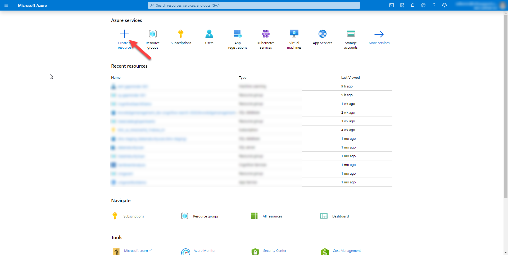
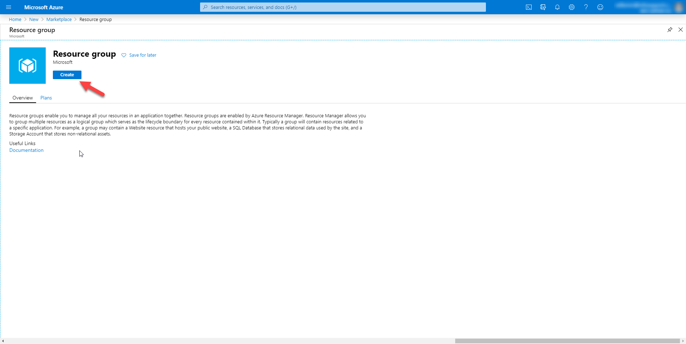
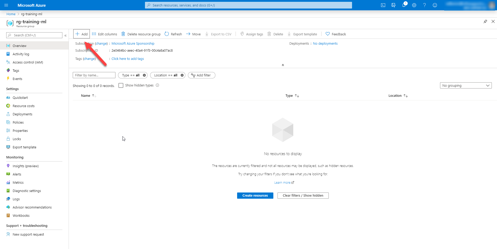
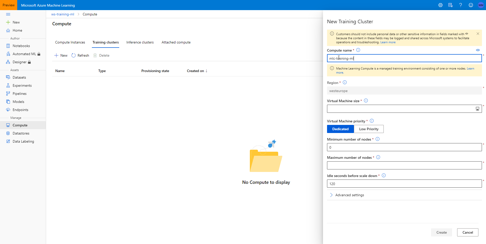

# LAB 4 - Running your project as an experiment in Azure Machine Learning Service

In this lab we'll explore how to use Azure Machine Learning Service to run experiments.
We'll cover the following topics:

- Setting up a machine learning workspace
- Creating a dataset
- Running an experiment

## Setting up a machine learning workspace

To run machine learning experiments on Azure you'll need to create a machine
learning workspace. Creating a machine learning workspace is performed in
two steps:

- Creating a new resource group
- Creating a new workspace

Let's start with a new resource group

### Creating a new resource group

The resource group will contain the workspace resources. Follow these
steps to create the resource group:

- Navigate to https://portal.azure.com/ login with your account
- Click the `+` button on the homepage.



- Next, search for `resource group` and press <kbd>ENTER</kbd>.
- Select the `Resource Group` item from the list and click `Create`.



- Enter a name for the resource group
- Choose `West Europe` as the region for the group
- Then, Click `review + create` to go to the final step of the wizard
- Finally, Click `Create` to create the resource group

### Creating a new workspace

Once the resource group is created, it's time to create the workspace.
Follow these steps to create the workspace:

- Navigate to the resource group you just created.
- Next, click the `Add` button to create a new resource.



- Then, search for `machine learning` and select `Machine learning` from the dropdown.
- Next, click `Create`


- Use the following details to create the workspace

  - Workspace Name: Choose a unique name
  - Region: West Europe
  - Workspace edition: Basic

- Click `Review + Create`
- Click `Create`

It will take a few minutes for the workspace to be fully operational.

### Installing the Azure ML SDK

Once you've got a workspace, you can prepare your computer for working with
the workspace. Follow these steps to prepare your computer:

- Open an Anaconda prompt
- Execute the command `pip install azureml-sdk`

## Creating a dataset

Once the workspace is ready, navigate to the `starter` folder and open it
in VSCode.

Next, navigate to the workspace on the Azure Portal (https://portal.azure.com).
Download the `config.json` file and save it in the root of your project folder.

Then, copy the following code into the file `src/data/make_dataset.py`.

```python
import logging
import click
from pathlib import Path
from azureml.core import Workspace, Dataset


@click.command()
@click.argument('input_filepath', type=click.Path(exists=True))
@click.argument('dataset_name', type=str)
def main(input_filepath, dataset_name):
    ws = Workspace.from_config()
    datastore = ws.get_default_datastore()

    logging.info(f'Uploading {input_filepath} to the workspace')

    datastore.upload(input_filepath, target_path=f'processed/{dataset_name}',
                     overwrite=True, show_progress=True)

    logging.info('Registering the uploaded data as a dataset')

    dataset = Dataset.Tabular.from_delimited_files(
        path=[(datastore, f'processed/{dataset_name}')])

    dataset.register(ws, dataset_name)


if __name__ == '__main__':
    log_fmt = '%(asctime)s - %(name)s - %(levelname)s - %(message)s'
    logging.basicConfig(level=logging.INFO, format=log_fmt)

    main()
```

This script performs the following steps:

- It retrieves the workspace based on the `config.json` you created.
- Next, it determines the default data store for the workspace.
- Then, it uploads the data files from the input path to workspace.
- After, it creates a new dataset from the blob storage path.
- Finally, it registers the dataset.

Run the experiment using the following command:

```
python src/data/make_dataset.py data/external auto-mpg
```

The first argument is the input folder where the data is located.
The second argument is the name of the dataset that's created.

When you've set up the dataset for your experiment, it's time to set up the
experiment itself.

## Running an experiment

Running an experiment in Azure Machine Learning Service can be done
in two ways:

- On your local machine
- On a remote compute target

We'll start training from your local machine.

### Running an experiment on a local machine

In the project, create a new file `src/models/train.py` and add the
following content to the file:

```python
import click
import pickle
from azureml.core import Workspace, Experiment, Dataset
from sklearn.model_selection import train_test_split
from sklearn.linear_model import LinearRegression


@click.command()
def main():
    workspace = Workspace.from_config()
    dataset = Dataset.get_by_name(workspace, 'auto-mpg')

    df_milage = dataset.to_pandas_dataframe()

    X = df_milage[['cylinders', 'displacement', 'horsepower',
                   'weight', 'acceleration', 'model year', 'origin']]
    y = df_milage[['mpg']]

    X_train, X_test, y_train, y_test = train_test_split(X, y, test_size=0.2)

    experiment = Experiment(workspace, 'linear_regression')

    with experiment.start_logging() as run:
        model = LinearRegression()
        model.fit(X_train, y_train)

        run.log('r_squared', model.score(X_test, y_test))


if __name__ == '__main__':
    main()
```

This script performs the following steps:

- It will retrieve the workspace based on the `config.json` in the project.
- Next, it will retrieve the dataset and preprocess it for training.
- Then, it will create a new experiment.
- After that, it will start a new run.
- Finally, it will train the model and log the metrics to the experiment run.

Start the script using the following command:

```
python src/models/train.py
```

We're not storing the trained model for now, we'll look at that in the next lab.

Now that you've trained the model, navigate to https://ml.azure.com/
log in and check the results in the portal. You can find the results
under `Experiments` in the navigation bar on the left of the screen.

### Creating a compute environment

Training locally is not the only option. You can also train your experiment
on a remote compute target.

To create a new compute target, follow these steps:

- Navigate to https://ml.azure.com/
- Click on `Compute`
- Click on the `Training cluster` tab
- Click `New`
- Choose a name for the virtual machine
- Specify `STANDARD_D3_V2` as the VM size
- Click `Create`



### Running an experiment remotely

Now that you have a remote training cluster, you can start running experiments against it.
Create a new file `src/models/submit_experiment.py` and copy the following code into the file:

```python
import shutil
import click
from pathlib import Path
from azureml.core import Workspace, Experiment, Dataset, Run, ComputeTarget
from azureml.train.sklearn import SKLearn


@click.command()
def main():
    workspace = Workspace.from_config()
    experiment = Experiment(workspace, 'linear_regression')
    compute_target = ComputeTarget(workspace, 'mlc-training-ml')

    root_folder = str(Path(__file__).parent)

    shutil.copy(Path(root_folder, '../../config.json'),
                Path(root_folder, 'config.json'))

    estimator = SKLearn(source_directory=root_folder,
                        compute_target=compute_target,
                        entry_script='train.py')

    experiment.submit(estimator)


if __name__ == '__main__':
    main()

```

This script performs the following steps:

- First, it retrieves the workspace
- Then, it retrieves the experiment from the workspace
- Next, it looks up the compute target that we created
- After that, it creates a new scikit-learn estimator trainer
- Finally, it submits the trainer to the experiment as a new run

Run the script using the following command:

```
python src/models/submit_experiment.py
```

After the experiment is started, you can monitor its progress through the portal

- Navigate to https://ml.azure.com/
- Select experiments
- Click on the experiment

You'll find it queued. It will take a few minutes for the training cluster
to spin up and run your experiment.
