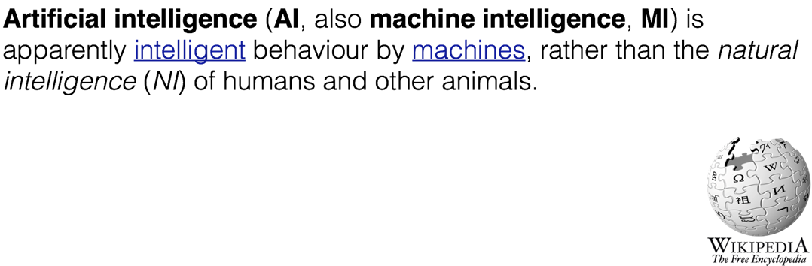
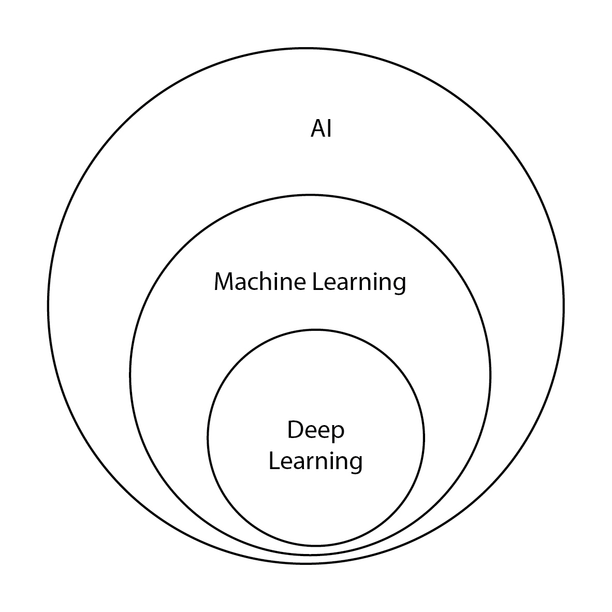
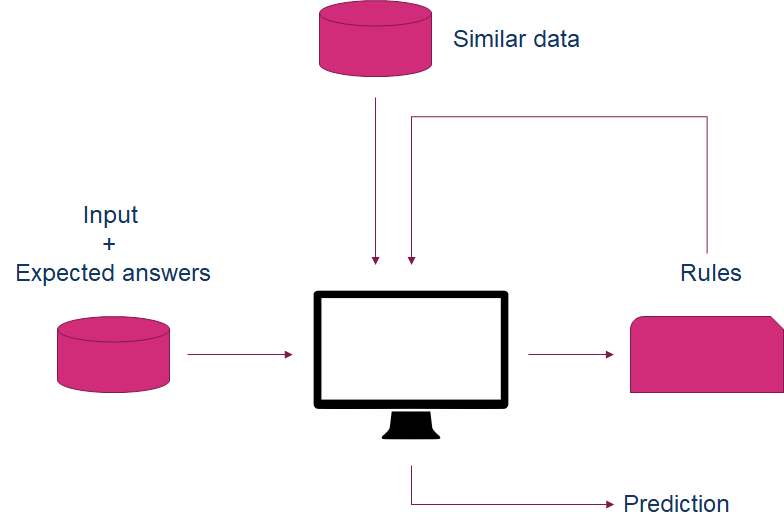
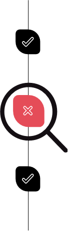
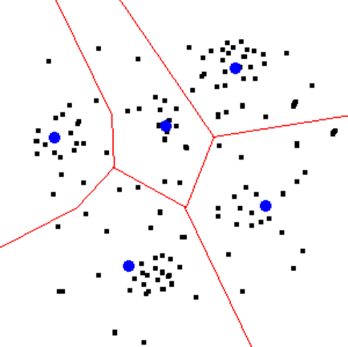

# HOUR 1

Introduction into machine learning

---

## What is AI?

---~

---~

## Strong vs Weak AI

---~

### Strong AI

- Wide range of abilities
- Self-improving systems
- Has feelings?

---~

### Weak AI

- Search algorithms
- Pattern recognition
- Signal processing

---~

## Relationship between AI, ML, and deep learning

---~

---

## What does a machine learning application look like?

---~

### Human intelligence

---~

### Machine intelligence

---

## Types of machine learning

- Supervised learning
- Unsupervised learning

---~

### Supervised learning

- You have data that contains input and answers produced by the input <!-- .element: class="fragment" -->
- The machine learnings to transform the input to the answer <!-- .element: class="fragment" -->

---~

### Samples of supervised learning

---~

### Regression

- Predicting the price of a house
- Predicting number of visitors

---~

### Classification

- Predicting fraud
- Detecting valid/invalid documents

---~

### Recommendations

- Showing a list of interesting videos
- Showing a list of products that others bought before

---~

### Unsupervised learning

- You have data, but you're looking for structure <!-- .element: class="fragment" -->
- The machine learns the structure of your data <!-- .element: class="fragment" -->
- In some cases it provides useful answers <!-- .element: class="fragment" -->

---~

### Samples of unsupervised learning

---~

### K-means clustering

---~

### Anomaly detection

---

## The toolbox

---~

### Python

- Dynamic programming language
- Invented by Guido van Rossum
- Released in 1991

---~

### Scikit-learn

- A scientific toolkit for building machine learning applications
- Includes machine learning algorithms
- Also includes tools to preprocess data and validate models

---~

### Pandas

- A data wrangling tool that uses the notion of data frames (tables)
- Contains a lot of utility functions for statistical analysis of data
- Also provides cool ways to visualize and edit data

---~

### Numpy

- A basic numeric framework in Python for matrices and vectors
- Highly optimized for usage against a CPU
- Basis for all the machine learning stuff