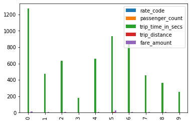
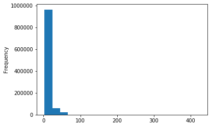

# HOUR 3

Data wrangling with pandas

---

## What is pandas?

* Introduces the concept of a dataframe
* Similar to a table where you store multiple rows
* Each column can have a different type

---

## What's a data frame?

<table>
    <thead>
        <th>Index</th>
        <th>Series</th>
        <th>Series</th>
    </thead>
    <tbody>
        <tr>
            <td>value</td>
            <td>value</td>
            <td>value</td>
        </tr>
        <tr>
            <td>value</td>
            <td>value</td>
            <td>value</td>
        </tr>
        <tr>
            <td>value</td>
            <td>value</td>
            <td>value</td>
        </tr>
        <tr>
            <td>value</td>
            <td>value</td>
            <td>value</td>
        </tr>
        <tr>
            <td>value</td>
            <td>value</td>
            <td>value</td>
        </tr>
    </tbody>
</table>

---~

### Column oriented

* Every column is stored as a Series (array)
* Data is stored as numpy arrays

---~

### An index is used

* To identify rows (a primary key if you will)

---

## Getting pandas

```
pip install pandas
```

Anaconda includes pandas by default, so you don't have to install it.

---

## Working with data frames

---~

### Importing pandas

``` python
import pandas as pd
```

---~

### Creating a data frame

``` python
my_array = np.random.random((2,2))
my_index = np.array(['row 1','row 2'])
column_names = np.array(['col 1', 'col 2'])

df = pd.DataFrame(
    data=my_array, 
    index=my_index, 
    columns=column_names
)
```

```
          col 1     col 2
row 1  0.696469  0.286139
row 2  0.226851  0.551315
```
<!-- .element: class="fragment" -->

---~

### Creating a data frame

Usually though, you'll load data from disk.

``` python
df = pd.read_csv('filename.csv', sep=';')
df = pd.read_excel('filename.xlsx')
```

---

## Inspecting data frames

---~

### Getting information about the data frame
 
``` python
df.info()     # Prints general information about your data frame
df.describe() # Statistical information about the data
```

---

## Slicing data frames

---~

### Selecting rows

``` python
df.loc['some_index', :] # Select rows with the specified key
df.iloc[0:50, :] # Select rows 0-50
```

---~

### Selecting rows (2)

``` python
df.loc[['a','b'], :] # Select rows with the specified key
df.iloc[[0:50], :] # Select rows 0-50
```

---~

### Selecting columns

``` python
df.loc[:,['a','b']] # Select a number of columns
df.iloc[:,1] # Select the second column
```

---~

### Iterating over rows

``` python
for index, row in df.iterrows():
    row['a'] * row['b']
```

---~

### Slicing using boolean expressions

Sometimes you want to filter rows based on conditions.

```
df[df['a'] >= 10] # Filter rows based on a condition.
```

```
is_greater_than_ten = df['a'] >= 10
# [True, False, True, True]
```
<!-- .element: class="fragment" -->

```
df[is_greater_than_ten]
# Rows that contain True are selected.
```
<!-- .element: class="fragment" -->

---

### Manipulating data

---~

### Creating new columns

``` python
df['new_column'] = df['a'] * 23.7
```

---~

# Transforming data

```
df['new_column'] = df['a'].apply(lambda x: x * 23.7)
```

``` python
def transform_data(data):
    return data * 23.7

df['new_column'] = df['a'].apply(transform_data)
```
<!-- .element: class="fragment" -->

---

## Visualizing data frames

---~

### Plotting a bar chart

``` python
import matplotlib.pyplot as plt

df.plot.bar() # Plot all data in the frame as bars
plt.show() # Render the plot inline
```



---~

### Plotting a histogram

``` python
import matplotlib.pyplot as plt

df['fare_amount'].plot.hist(bins=20)
plt.show()
```



---

## Learning more

* https://pandas.pydata.org/pandas-docs/stable/index.html

